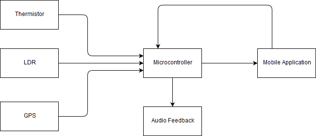

# Helping Hat
### IoT Standards and Protocols Project Repository

A hat with an attached mucrocontroller with light and temperature sensors and GPS tracking capabilities.
Created to help parents/carers of blind and special needs children.

The microcontroller will take in data from the thermistor, LDR and GPS and use it to inform the wearer of certain situations (to get to shade if it's very sunny, hydrate if it's warm, return home) and also upload this data to a web server, accessible though a mobile app by the carer to easily keep track of the status of the wearer.
