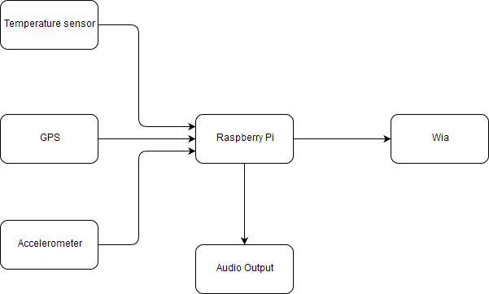

# Helping Hat
## IoT Standards and Protocols Project Repository

A hat with an attached microcontroller with light and temperature sensors and GPS tracking capabilities.
Created to help parents/carers of blind and special needs children.

The Raspberry Pi on the helping hat is equipped with a SenseHat, and uses both the temperature sensor and accelerometer built in to upload values to wia.io. The Pi will also output audio messages using the eSpeak text-to-speech engine when the temperature increases past a certain point. The Pi also uses NodeJS to connect to a Blynk app on the users phone to obtain the GPS co-ordinates of the user.

## Dependencies

### Blynk
You will need the Blynk mobile for this project. It's available on both the App Store and Google Play Store.

### Node

First you will need to install Node (npm) on your Pi.

>sudo apt-get install npm

Then initialise a new Node project in your chosen directory.

> npm init

You will also need to install the Blynk dependencies.

> sudo npm install blynk-library --save

> sudo npm install onoff ---save

Replace your index.js with my index.js and run the script by entering the following in the command line:

> node index.js

### Wia

> pip install wia

### SenseHat libaries

> sudo apt-get install sense-hat

### eSpeak (text-to-speech engine)

>sudo apt-get install espeak

## Setup

First download the Blynk app to your mobile phone and create a new project using a Raspberry Pi 3 B and wi-fi connection. Create a GPS stream widget and set it to V1. The authentification code will be sent over email, you will need this later.

Next you will create a device on wia.io. Create an account and create a new Raspberry Pi device. You will need to create a text widget for both temperature and acceleration, and a map widget for the GPS.

Now go into index.js and app.py and change the Blynk auth code and wia code to your own. (You can find the wia code in the configuration tab on your device's dashboard.)
